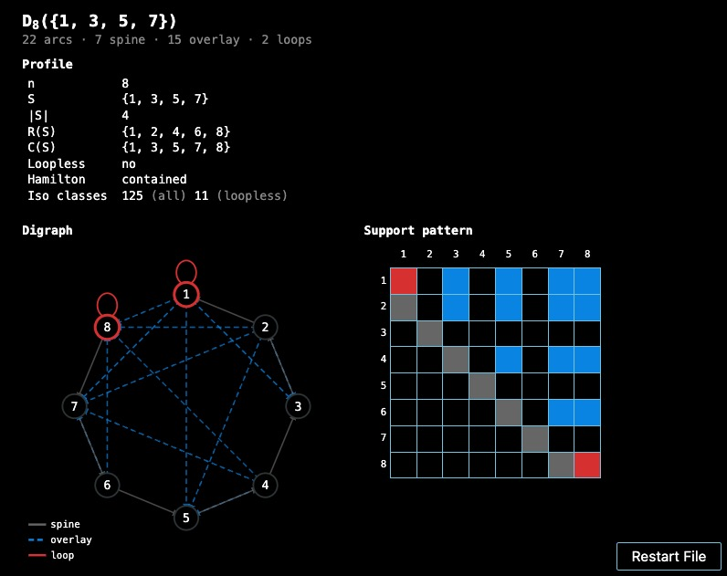
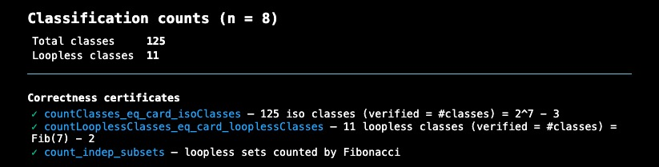

<h1 align="center">Hessenberg Digraphs</h1>

<p align="center">
  <a href="https://digraph-kohl.vercel.app/"></a>
  
</p>

<p align="center">
  A Lean&nbsp;4 formalization of the classification of support digraphs of real
  orthogonal upper Hessenberg matrices — with a <b>verified interactive
  calculator</b> for D<sub>n</sub>(S), a paper website (Verso), a blueprint
  dependency graph, and an API reference.
</p>

<p align="center">
  <a href="https://digraph-kohl.vercel.app/">Website</a> &nbsp;·&nbsp;
  <a href="https://digraph-kohl.vercel.app/verso/_site/html-multi/">Paper</a> &nbsp;·&nbsp;
  <a href="https://digraph-kohl.vercel.app/blueprint/web/">Blueprint</a>
</p>

<p align="center">
  
</p>

## Main result

**Classification.** Fix $n \ge 2$. An unreduced real orthogonal upper Hessenberg
matrix $Q \in \mathbb{R}^{n \times n}$ factors as a product of $n - 1$ adjacent
Givens rotations. The zero / non-zero pattern of $Q$ is determined by a subset
$S \subseteq \\{1, \ldots, n - 1\\}$ (the *active set*), and the resulting
support digraph is exactly $D_n(S)$, the directed Hamilton cycle
$1 \to n \to (n - 1) \to \cdots \to 2 \to 1$ together with overlay arcs
determined by $S$. Conversely, every such $S$ arises from some matrix; and
for $|S|, |S'| \ge 2$, $D_n(S) \cong D_n(S')$ implies $S = S'$.

The number of non-isomorphic connected support digraphs on $n$ vertices is

$$N_n \\;=\\; 2^{\\,n-1} \\;-\\; \\lfloor (n-1)/2 \\rfloor;$$

the loopless restriction reduces this to
$F_{n-1} - \lfloor (n-3)/2 \rfloor$ where $F_k$ is the $k$-th
Fibonacci number. These counts are formalized as genuine **cardinality**
theorems (`card_isoClasses`, `card_looplessClasses`): a complete isomorphism
invariant — proved complete by `isoInvariant_eq_iff` — takes exactly that
many distinct values, not merely the arithmetic identity.

The apex theorem `HessenbergDigraphs.classification` bundles realizability,
the bridge from matrix entries to the combinatorial model, and rigidity.

## Verified interactive calculator

The library ships a Lean-checked calculator for `D_n(S)`, usable in any
editor with the Lean extension — see `lean/Playground.lean`:

```lean
#hessenberg 8 {1, 3, 5, 7}   -- full profile of D_8({1,3,5,7}): arcs, loops, degrees, …
#hessenberg_count 8          -- isomorphism-class counts for n = 8
```

The first command renders the dashboard shown above — the per-vertex
profile, the circular digraph, and the support pattern. Every quantity it
draws is the **formal object evaluated**, not a parallel
re-implementation: arcs and loops are computed by `decide (Arc S · ·)` on the
formal arc relation, and degrees by the formal `outDeg` / `inDeg`. Membership
specification theorems pin each computed list to its definition —
`mem_arcList_iff_digraph` (the rendered arc list **is** `D_n(S)`),
`isLoopless_iff`, `mem_degreeList_iff` — and the displayed class counts are
tied to the cardinality theorems above via `countClasses_eq_card_isoClasses`
and `countLooplessClasses_eq_card_looplessClasses`. Each fact the widget
shows names the load-bearing theorem behind it.

<p align="center">
  
</p>

The calculator is layered: `Compute/` (verified enumeration backend),
`Render.lean` (the widget data contract), and `Command.lean` (the
`#hessenberg` / `#hessenberg_count` syntax).

## Project layout

```
.
├── lean/                  Lean 4 formalization (the primary artifact)
│   ├── HessenbergDigraphs.lean            top-level facade
│   ├── HessenbergDigraphs/
│   │   ├── Vertex.lean, ActiveSet.lean    cross-tier paper-side primitives
│   │   │                  (vertices, active set, activeRows/Cols, D_n(S))
│   │   ├── Combinatorial/ Tier 1: pure theory of D_n(S)
│   │   │                  (Arc, Digraph, Loop, Hamilton, Degree, Cut,
│   │   │                  Rigidity, Singleton/, Enumeration, ClassCount)
│   │   ├── Matrix/        Tier 2: pure matrix theory
│   │   │                  (Hessenberg, Orthogonal, OrthogonalHessenberg,
│   │   │                  SignEquivalence, UnreducedAngles, Givens/…)
│   │   ├── Realization/   Tier 3: matrix → digraph realization
│   │   │                  (ActiveSet, Vanishing, Propagation, DigraphModel)
│   │   ├── Compute/       verified calculator backend
│   │   │                  (Enumerate, Query, Repr)
│   │   ├── Render.lean, Command.lean   widget + #hessenberg commands
│   │   ├── PaperExamples.lean  concrete D₅, D₆ instances
│   │   └── Classification.lean   apex theorem
│   ├── Playground.lean    try the verified calculator
│   ├── Util/              project tooling
│   │   ├── Audit.lean     lake exe hessenberg-audit (axiom + API health)
│   │   └── Compression.lean   lake exe hessenberg-compression (metrics)
│   └── lakefile.toml
│
├── paper/                 LaTeX source for the paper
│
└── site/                  Deployable static site (Vercel-ready)
    ├── index.html         landing page
    ├── verso/             Verso paper website source + rendered HTML
    │   ├── Paper.lean     top-level Verso doc
    │   ├── Paper/         {Setup, Theorems, Enumeration, Tikz}.lean
    │   └── _site/html-multi/   committed rendered HTML
    ├── blueprint/         leanblueprint source + rendered HTML
    │   ├── src/           content.tex, web.tex, print.tex, macros/
    │   └── web/           committed rendered HTML + dep graph SVG
    └── docs/              doc-gen4 output (HessenbergDigraphs subset only;
                           Mathlib/Std/Init not shipped due to size)
```

The combinatorial and matrix tiers are dependency-graph independent:
neither imports the other directly. They meet only in the realization
(bridge) tier. The cross-tier primitives `Vertex` and `ActiveSet` are the
shared base and may be imported by any tier.

## Building

After editing the site sources (`site/verso/Paper/*.lean` or
`site/blueprint/src/*.tex`), regenerate the deployable HTML with
`./site/rebuild.sh` (rebuilds the Verso website, and the blueprint when
`plastex` is installed), then `git add site/ && git commit && git push`.
The individual steps are below.

### Lean library

```bash
cd lean
lake exe cache get          # download Mathlib oleans
lake build                  # compile the library
lake exe hessenberg-audit   # axiom + public-API health check
```

Requires Lean 4 v4.28.0 and Mathlib v4.28.0 (resolved by Lake).

To try the calculator, open `lean/Playground.lean` in an editor with the
Lean 4 extension and place the cursor on a `#hessenberg` command.

### Verso paper website

```bash
cd site/verso
lake exe cache get
lake build
lake exe generate-paper --output _site
# served at site/verso/_site/html-multi/
```

### Blueprint

```bash
cd site/blueprint/src
plastex -c plastex.cfg --dir=../web web.tex
# served at site/blueprint/web/
```

Requires LaTeX, Python with `plastex`, `plastexdepgraph`,
`leanblueprint`, and Graphviz.

### API docs

```bash
cd lean
lake build HessenbergDigraphs:docs   # produces .lake/build/doc/
```

For the deployed `site/docs/`, only the `HessenbergDigraphs/` subdirectory
plus the search infrastructure is shipped (~30 MB); links into Mathlib /
Std / Init / Lean modules will 404 in the deployed copy.

## Local preview

```bash
cd site
python3 -m http.server 8000
# http://localhost:8000/
```

## Status

* Zero `sorry` anywhere under `lean/HessenbergDigraphs/`.
* Foundational axioms reduce to `{propext, Classical.choice, Quot.sound}`
  for every paper-facing public theorem — including the count cardinalities
  `card_isoClasses` / `card_looplessClasses` — verified mechanically by
  `lake exe hessenberg-audit`.
* The interactive calculator is verified end to end: every value it renders
  is computed from the formal definitions and characterized by a named
  theorem (no unverified re-implementation).
* The Lean code, paper website, blueprint, and API docs are all kept
  in sync; rebuild any of them and re-commit `site/` to redeploy.
```

## Licence

Two, because the repository carries two kinds of work and they are reused
differently.

| | Licence | File |
|---|---|---|
| `lean/` — the formalization | Apache-2.0 | [`lean/LICENSE`](lean/LICENSE) |
| everything else — the hypergraph, the chapters, the paper, the figures | CC-BY-4.0 | [`LICENSE`](LICENSE) |

Apache-2.0 for the library because that is what a Lean library is expected to
be — it is Mathlib's licence, and a downstream project that imports from here
should not have to check whether it may. CC-BY-4.0 for the network because
the network is a document: what it asks of a reuser is attribution, not
patent terms.

Every `.lean` file names its own licence in its header. `CITATION.cff` is how
to cite the network.
